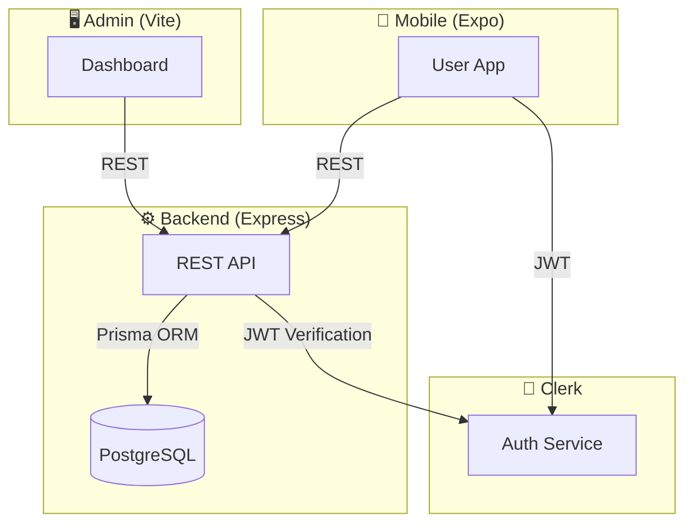

<div align="center">
  <h1>🚗 Drivo</h1>
  <p><strong>Ride-Hailing MVP — Full-Stack Mobile Architecture</strong></p>

  <p>
    
    
    
    
    
    
    
    
    
  </p>
</div>

---

## 📋 Table of Contents

- [Overview](#overview)
- [Architecture](#architecture)
- [Projects](#projects)
  - [Backend API](#1-backend-api)
  - [Mobile App](#2-mobile-app)
  - [Admin Dashboard](#3-admin-dashboard)
- [Development Workflow](#development-workflow)
- [Architecture Principles](#architecture-principles)

---

## Overview

Drivo is an Uber-like ride-hailing MVP built with three independent projects connected through a shared PostgreSQL database and Clerk authentication.



---

## Architecture

### Repository Branches

| Branch | Contains | Status |
|--------|----------|--------|
| `main` | Root docs + initial scaffold of all 3 projects | ✅ Live |
| `backend` | Express + Prisma + PostgreSQL API | ✅ Running |
| `mobile` | Expo SDK 56 React Native app | ✅ Running |
| `admin` | Vite 8 + React 19 admin dashboard | ✅ Running |

### Data Flow

```
┌─────────────┐     HTTP/JSON      ┌──────────────┐     Prisma ORM     ┌────────────┐
│  Mobile App  │ ──────────────────→ │  Express API  │ ─────────────────→ │ PostgreSQL │
│  (Expo RN)   │ ←───────────────── │  (Backend)    │ ←──────────────── │  (Neon)    │
└─────────────┘                     └──────────────┘                   └────────────┘
       │                                   │
       │ Clerk JWT                         │ Clerk Webhook
       ▼                                   ▼
┌─────────────┐                     ┌──────────────┐
│   Clerk     │ ←───────────────── │  Admin Dash  │
│  Auth Svc   │                     │  (Vite/React)│
└─────────────┘                     └──────────────┘
```

---

## Projects

### 1. Backend API

**Stack:** Express 4 · TypeScript 5 · Prisma 6 · PostgreSQL (Neon) · Clerk · Zod

Clean layered modular monolith with strict unidirectional dependencies:

```
src/
├── app.ts                  # Express app assembly
├── server.ts               # Entry point (DB connect, listen, signals)
├── config/
│   ├── env.ts              # Zod-validated env vars (fail-fast)
│   └── database.ts         # PrismaClient singleton
├── errors/                 # AppError base + 7 subclasses (400-500)
├── middleware/
│   ├── auth.middleware.ts  # requireAuth guard (Clerk)
│   ├── error.middleware.ts # Global error handler
│   ├── notFound.ts         # 404 catch-all
│   └── validate.middleware.ts # Zod body validator factory
└── modules/
    ├── users/              # User CRUD
    │   ├── user.routes.ts
    │   ├── user.controller.ts
    │   ├── user.service.ts
    │   ├── user.repository.ts
    │   └── user.types.ts
    └── webhook/            # Clerk webhook sync
        ├── webhook.routes.ts
        ├── webhook.controller.ts
        ├── webhook.service.ts
        ├── webhook.repository.ts
        ├── webhook.mapper.ts
        ├── webhook.types.ts
        └── events/         # Strategy pattern per event type
            ├── index.ts
            ├── user-created.ts
            ├── user-updated.ts
            └── user-deleted.ts
```

#### Middleware Pipeline

```
Security  →  CORS  →  Logging  →  Webhook (raw body)
→  JSON Parser  →  Clerk Auth  →  Routes  →  404  →  Error Handler
```

#### Getting Started

```bash
cd backend
npm install
cp .env.example .env
npx prisma migrate dev
npm run dev              # → http://localhost:3000
```

---

### 2. Mobile App

**Stack:** Expo SDK 56 · React 19 · Expo Router · NativeWind 5 · Tailwind CSS 4 · Clerk · Axios · Zod

Feature-based architecture with file-based routing:

```
src/
├── app/                          # Expo Router (file-based routing)
│   ├── _layout.tsx               # Root providers
│   ├── index.tsx                 # Entry → onboarding or auth
│   └── (app)/
│       ├── _layout.tsx           # Onboarding gate
│       ├── onboarding/           # 3-slide carousel
│       ├── (auth)/               # Welcome → Sign In / Sign Up
│       └── (root)/               # Authenticated tab layout
├── features/
│   ├── auth/                     # ✅ Complete (screens, hooks, components, validation)
│   ├── onboarding/               # ✅ Complete
│   ├── home/                     # 🔄 Partial (real map + location, mock rides)
│   ├── history/                  # ⬜ Placeholder
│   ├── chat/                     # ⬜ Placeholder
│   └── profile/                  # 🔄 Minimal (sign out only)
├── api/                          # Axios client + interceptors + token injection
├── shared/                       # 7 reusable components + snackbar context
├── errors/                       # 5 typed error classes
├── hooks/                        # Global hooks
├── lib/                          # Context providers + utilities
├── providers/                    # Clerk → axios token bridge
└── constants/                    # Environment config
```

#### Navigation Flow

```
App Launch
  └── Onboarding (first launch only)
        └── Welcome Screen
              ├── Sign Up → Email + OTP Verification
              ├── Sign In → Email + Password
              └── Google OAuth
                    └── Home Tabs (Map · History · Chat · Profile)
```

#### Getting Started

```bash
cd mobile
npm install
cp .env.example .env
npx expo start           # → Expo dev server
```

---

### 3. Admin Dashboard

**Stack:** Vite 8 · React 19 · TypeScript 6 · Tailwind CSS 4

Fresh scaffold — ready for feature development:

```
src/
├── main.tsx              # React entry point
├── App.tsx               # Placeholder
└── index.css             # @import "tailwindcss"
```

#### Getting Started

```bash
cd admin
npm install
npm run dev               # → http://localhost:5173
```

---

## Development Workflow

Run each project in a separate terminal:

| Project | Command | Port |
|---------|---------|------|
| Backend | `cd backend && npm run dev` | `3000` |
| Mobile | `cd mobile && npx expo start` | `8081` |
| Admin | `cd admin && npm run dev` | `5173` |

---

## Architecture Principles

<details>
<summary><strong>Expand</strong></summary>

- **Independent projects** — no monorepo tooling, each project is standalone
- **Feature-based modules** — each feature owns its screens, hooks, components, types, and data
- **Clean layering** — routes → controllers → services → repositories (strict dependency direction)
- **External auth** — Clerk handles authentication; backend verifies via middleware
- **Zod validation** — env variables and request bodies validated at the boundary, fail-fast on startup
- **Custom error classes** — typed `AppError` hierarchy with HTTP status codes, caught by global handler
- **Token injection** — mobile uses inversion of control to bridge Clerk's `getToken` into Axios interceptors
- **Webhook idempotency** — Svix ID deduplication via `ProcessedWebhook` table
- **Disposable branches** — feature branches deleted after merge to keep the repo clean

</details>

---

<div align="center">
  <sub>Built with TypeScript · React Native · Express · PostgreSQL</sub>
</div>
