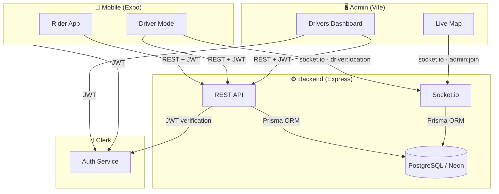

<div align="center">
  <h1>🚗 Drivo</h1>
  <p><strong>Ride-Hailing MVP — Full-Stack Mobile Architecture</strong></p>

  <p>
    
    
    
    
    
    
    
    
    
    
    
  </p>
</div>

---

## 📋 Table of Contents

- [Overview](#overview)
- [Screenshots](#screenshots)
- [Architecture](#architecture)
- [Technologies](#technologies)
- [Projects](#projects)
  - [Backend API](#1-backend-api)
  - [Mobile App](#2-mobile-app)
  - [Admin Dashboard](#3-admin-dashboard)
- [WebSocket Events](#websocket-events)
- [Development Workflow](#development-workflow)
- [Architecture Principles](#architecture-principles)

---

## Overview

Drivo is an Uber-like ride-hailing MVP. It combines a driver-delivery mode (sign up → get approved → go online → stream live location) with a live admin map that shows every online driver in real time — plus a full rider flow: pick destination from Google autocomplete, see nearby cars streaming over WebSocket, request a ride and get matched with a driver.



**Core flows:**
- **Driver flow:** a user becomes a driver → the admin approves the application → the driver goes online from the mobile app → location pings stream over socket.io → the admin's live map renders every online driver in near-real time.
- **Rider flow:** pick origin/destination (Google Places autocomplete) → see nearby cars on the map in real time → request a ride → backend matches a driver → rider sees the assigned driver card live.

### Progress

| Phase | Scope | Status |
|-------|-------|--------|
| 1 | Auth, onboarding, users, profile, driver applications + admin approval | ✅ Done |
| 2 | Driver mode: availability, live location streaming, stale sweep, admin live map | ✅ Done |
| 3 | Ride requests: fare estimate, TTL expiry, cancel, ride history | ✅ Done |
| 4 | Realtime riders: socket-based nearby drivers, fake-driver matching, driver-assigned UI | ✅ Done |
| 5 | **Day 7 — Driver requests & matching**: real drivers receive offers, accept/reject, per-offer timeouts, dispatch escalation | 🚧 In progress |

---

## Screenshots

> Screenshots pending — captured from the running emulator/simulator once the dev client is rebuilt. Expected sections below.

| Area | Screenshot |
|------|-----------|
| Driver profile (become a driver) | _pending_ |
| Driver mode (go online, live map) | _pending_ |
| Admin drivers dashboard | _pending_ |
| Admin live map | _pending_ |

**Demo:** run the [development workflow](#development-workflow) to try it locally.

---

## Architecture

### Repository Branches

| Branch | Contains | Status |
|--------|----------|--------|
| `main` | Stable, reviewed milestones | ✅ Live |
| `dev` | Active development (ride requests + realtime matching complete; driver-offer dispatch in progress) | ✅ Active |

Feature branches are cut from `dev` and deleted after merge.

### Data Flow

```
┌─────────────┐   HTTP/JSON + JWT   ┌──────────────┐   Prisma ORM   ┌────────────┐
│  Mobile App  │ ──────────────────→ │  Express API  │ ─────────────→ │ PostgreSQL │
│  (Expo RN)   │ ←───────────────── │  (Backend)    │ ←───────────── │  (Neon)    │
└─────────────┘                     └──────────────┘                └────────────┘
       │                                    │
       │ socket.io (driver location)        │ socket.io (admin live map)
       ▼                                    ▼
┌─────────────┐                       ┌──────────────┐
│  Socket.io   │ ←─────────────────── │  Socket.io    │
│  Driver pos  │    drivers:locations │  Admin feed   │
│  ping        │                      │  (throttled)  │
└─────────────┘                       └──────────────┘
```

Driver location is delivered to the backend over **WebSocket when the app is in the foreground**, with a **REST fallback** (`POST /api/drivers/location`) for background execution. The backend throttles snapshot broadcasts (1s) and flips stale drivers (no ping for 15s) offline automatically.

### Key Design Decisions

- **Only approved drivers go online** — the online transition is an atomic `updateMany` gated on `approvalStatus === "APPROVED"`, enforced in both the socket path and the REST path.
- **Foreground/background share one location state** — socket preferred when connected, REST is the fallback; `distanceInterval`/`timeInterval` are upper-bound thresholds, not a fixed cadence.
- **Connectivity-aware driver mode** — no-internet or server-down flips an online driver offline after a 10s grace window (local flip; the server's 15s stale sweep confirms it on the admin map). Recovery re-asserts online automatically — socket-first, REST fallback — with a transient "back online" notice.
- **Liveness heartbeat decoupled from GPS motion** — a 10s heartbeat keeps parked/stationary drivers alive (the location provider suppresses callbacks when stationary). Device GPS is a health signal only: warn, never auto-drop an online driver.
- **Background location is best-effort** — not guaranteed after the app is force-killed; requires the dev client to be rebuilt with the native location modules linked.

---

## Technologies

| Layer | Tech |
|-------|------|
| Mobile | Expo SDK 56 · React Native 0.85 · React 19 · Expo Router · NativeWind 5 / Tailwind CSS 4 · react-native-maps · expo-location · expo-task-manager · socket.io-client · Axios · Zod |
| Backend | Express 4 · TypeScript 5 · Prisma 6 · PostgreSQL (Neon) · socket.io 4 · Clerk (JWT auth + webhooks) · Zod · SVix |
| Admin | Vite 8 · React 19 · TypeScript 6 · Tailwind CSS 4 · Leaflet + react-leaflet · socket.io-client · Clerk |

---

## Projects

### 1. Backend API

**Stack:** Express 4 · TypeScript 5 · Prisma 6 · PostgreSQL (Neon) · Clerk · socket.io · Zod

Clean layered modular monolith with strict unidirectional dependencies:

```
src/
├── app.ts                  # Express app assembly (routes, middleware, socket.io)
├── server.ts               # Entry point (DB connect, listen, signals)
├── config/
│   ├── env.ts              # Zod-validated env vars (fail-fast)
│   └── database.ts         # PrismaClient singleton
├── errors/                 # AppError base + 7 subclasses (400-500)
├── middleware/
│   ├── auth.middleware.ts  # requireAuth guard (Clerk)
│   ├── error.middleware.ts # Global error handler
│   ├── notFound.ts         # 404 catch-all
│   └── validate.middleware.ts # Zod body validator factory
├── modules/
│   ├── users/              # User CRUD
│   │   ├── user.routes.ts / controller / service / repository / types
│   ├── webhook/            # Clerk webhook sync (strategy pattern per event)
│   │   └── events/         # user-created / user-updated / user-deleted
│   ├── drivers/            # Driver applications, availability, live location
│   │   ├── driver.routes.ts / controller / service / repository / types
│   │   └── fake-drivers.simulator.ts  # Simulated fleet seeding for the map
│   ├── rides/               # Ride requests, matching, expiry
│   │   ├── ride.routes.ts / controller / service / repository / validation
│   │   ├── ride.notifications.ts      # rider socket pushes (driver:assigned)
│   │   └── fake-driver.simulator.ts   # auto-assigns fake driver to PENDING rides
│   ├── places/              # Google Places autocomplete proxy
│   ├── directions/          # Google Routes distance/duration proxy
│   └── admin/
│       └── drivers/        # Admin driver management + live feed endpoint
├── sockets/                # Socket.io driver availability & location streaming
│   ├── index.ts            # Socket server setup, auth handshake, rooms
│   ├── auth.ts             # Clerk token verification at connect
│   ├── types.ts            # Event names + payload contracts
│   └── snapshot.ts         # Stale detection + throttled admin broadcast
└── prisma/
    ├── schema.prisma       # User, DriverApplication, DriverProfile, etc.
    └── migrations/
```

#### Middleware Pipeline

```
Security  →  CORS  →  Logging  →  Webhook (raw body)
→  JSON Parser  →  Clerk Auth  →  Routes  →  404  →  Error Handler
```

#### API Reference

Base URL: `http://localhost:3000/api`

**Users**

| Method | Path | Auth | Description |
|--------|------|------|-------------|
| GET | `/users/me` | Clerk | Current user profile |
| PATCH | `/users/me` | Clerk | Update profile (validated + trimmed) |

**Webhook**

| Method | Path | Auth | Description |
|--------|------|------|-------------|
| POST | `/webhook` | SVix signature | Clerk user-created/updated/deleted sync |

**Drivers**

| Method | Path | Auth | Description |
|--------|------|------|-------------|
| POST | `/drivers/apply` | Clerk | Apply to become a driver (or re-apply) |
| GET | `/drivers/my-application` | Clerk | Current application + profile status |
| PUT | `/drivers/my-application` | Clerk | Update application |
| PUT | `/drivers/availability` | Clerk | Go online/offline (`{ isOnline: boolean }`) |
| POST | `/drivers/location` | Clerk | REST fallback for live location |
| GET | `/drivers/nearby?lat&lng&radiusKm` | Clerk | Online drivers around a point (seeds fake fleet) |

**Rides**

| Method | Path | Auth | Description |
|--------|------|------|-------------|
| POST | `/rides` | Clerk | Request a ride (fare computed, TTL set) |
| GET | `/rides/me/active` | Clerk | Current active ride (poll target for searching UI) |
| DELETE | `/rides/:id/cancel` | Clerk | Cancel a pending ride |
| GET | `/rides/recent` | Clerk | Recent ride history |

**Places & Directions**

| Method | Path | Auth | Description |
|--------|------|------|-------------|
| GET | `/places/autocomplete?input&lat&lng` | Clerk | Google Places autocomplete proxy |
| GET | `/directions?originLat&originLng&destLat&destLng` | Clerk | Route distance/duration (Google Routes) |

**Admin drivers**

| Method | Path | Auth | Description |
|--------|------|------|-------------|
| GET | `/admin/drivers` | Clerk (admin) | All driver applications |
| GET | `/admin/drivers/live` | Clerk (admin) | All online drivers with live coords (initial paint) |
| GET | `/admin/drivers/:id` | Clerk (admin) | Single application detail |
| PUT | `/admin/drivers/:id/approve` | Clerk (admin) | Approve application |
| PUT | `/admin/drivers/:id/reject` | Clerk (admin) | Reject application |
| PUT | `/admin/drivers/:id/suspend` | Clerk (admin) | Suspend driver |
| PUT | `/admin/drivers/:id/reinstate` | Clerk (admin) | Reinstate suspended driver |

#### Environment Variables

| Variable | Required | Purpose |
|----------|----------|---------|
| `PORT` | No (default 3000) | Server port |
| `NODE_ENV` | No (default `development`) | Runtime environment |
| `DATABASE_URL` | **Yes** | PostgreSQL connection string |
| `CLERK_SECRET_KEY` | **Yes** | Clerk backend auth + JWT verification |
| `CLERK_WEBHOOK_SIGNING_SECRET` | **Yes** | SVix webhook signature verification |
| `CLERK_PUBLISHABLE_KEY` | No | Frontend key (optional backend) |
| `STRIPE_SECRET_KEY` | No | Payments (reserved) |
| `STRIPE_WEBHOOK_SECRET` | No | Payments webhooks (reserved) |
| `GOOGLE_MAPS_API_KEY` | No | Maps service (reserved) |

#### Getting Started

```bash
cd backend
npm install
cp .env.example .env       # fill DATABASE_URL + Clerk keys
npx prisma migrate dev     # create/apply migrations
npm run dev                # → http://localhost:3000
```

Other useful scripts: `npm run db:studio` (Prisma Studio), `npm run typecheck` (tsc --noEmit).

---

### 2. Mobile App

**Stack:** Expo SDK 56 · React 19 · Expo Router · NativeWind 5 · Tailwind CSS 4 · Clerk · Axios · react-native-maps · expo-location · expo-task-manager · socket.io-client · Zod

Feature-based architecture with file-based routing:

```
src/
├── app/                          # Expo Router (file-based routing)
│   ├── _layout.tsx               # Root providers + driver-location task side-effect
│   ├── index.tsx                 # Entry → onboarding or auth
│   └── (app)/
│       ├── _layout.tsx           # Onboarding + auth gates (UserProvider here)
│       ├── onboarding/           # 3-slide carousel
│       ├── (auth)/               # Welcome → Sign In / Sign Up
│       └── (root)/               # Authenticated tab layout
│           ├── driver-mode.tsx   # Driver live-mode screen
│           ├── ride-request.tsx  # Rider: pick destination + request ride
│           └── ride-status.tsx   # Rider: searching → assigned driver card
├── features/
│   ├── auth/                     # ✅ Complete (screens, hooks, validation)
│   ├── onboarding/               # ✅ Complete
│   ├── home/                     # ✅ Real map + location
│   ├── drivers/                  # ✅ Complete
│   │   ├── services/             # driver-socket / driver-location-task / permissions
│   │   ├── hooks/useDriverMode.ts
│   │   ├── screens/              # driver-mode-screen, driver-profile-screen, ...
│   │   └── api/drivers.api.ts
│   ├── rides/                    # ✅ Complete (rider side)
│   │   ├── hooks/                # useRideRequest, useRideSocket, useNearbyDrivers, ...
│   │   ├── components/           # request form/map, searching card, assigned card
│   │   ├── enums/RideStatus.ts
│   │   └── types/ride.types.ts
│   ├── history/                  # ⬜ Placeholder
│   ├── chat/                     # ⬜ Placeholder
│   └── profile/                  # ✅ Profile + driver section
├── api/                          # Axios client + interceptors + Clerk token injection
├── shared/                       # Reusable components + snackbar + navigation + map style
├── errors/                       # Typed error classes
├── lib/                          # Context providers + utilities
└── constants/                    # Env config
```

#### Driver Mode Flow

```
Driver Profile ("Start Driving")
  → request location permissions (foreground + background)
  → connect driver socket (Clerk token auth)
  → emit driver:online             # backend gates on APPROVED
  → start background location task (expo-task-manager)
  → stream coords: socket when connected, REST fallback in background
  → "Go Offline": driver:offline + stop task
```

A 15s ping timeout on the backend marks the driver stale → offline → the admin map reflects it automatically.

#### Rider Ride Request Flow

```
Home map (nearby cars stream via drivers:nearby socket)
  → pick destination (Places autocomplete) + confirm origin
  → POST /rides            # fare from Routes API (haversine fallback), TTL set
  → searching card         # GET /rides/me/active poll + ride:assigned socket
  → fake-driver simulator assigns nearest car (~2.5s)
  → PENDING → ACCEPTED     # atomic, race-safe vs cancel/expiry
  → driver info card       # name, vehicle, plate, ETA, fare
```

#### Environment Variables

| Variable | Required | Purpose |
|----------|----------|---------|
| `EXPO_PUBLIC_CLERK_PUBLISHABLE_KEY` | **Yes** | Clerk public key |
| `EXPO_PUBLIC_API_URL` | **Yes** | Backend base URL (emulator: `http://10.0.2.2:3000`) |
| `EXPO_PUBLIC_CLERK_GOOGLE_ANDROID_CLIENT_ID` | For Google OAuth | OAuth client id |
| `EXPO_PUBLIC_CLERK_GOOGLE_WEB_CLIENT_ID` | For Google OAuth | OAuth web client id |
| `EXPO_PUBLIC_GOOGLE_MAPS_API_KEY` | **Yes** | Android/iOS Maps |

#### Getting Started

```bash
cd mobile
npm install
cp .env.example .env
npx expo run:android       # dev build — REQUIRED to link expo-location/expo-task-manager native modules
# or: npx expo start       # Metro-only (Expo Go has limits for background location)
```

> **Important:** background location + the live driver task depend on native modules (`expo-task-manager`, `expo-location`). They are only linked into the app with a dev client build (`npx expo run:android` / `run:ios`). That build must be rebuilt after `npm install` adds these packages.

---

### 3. Admin Dashboard

**Stack:** Vite 8 · React 19 · TypeScript 6 · Tailwind CSS 4 · Leaflet + react-leaflet · Clerk · socket.io-client

```
src/
├── main.tsx              # React entry (imports leaflet.css)
├── App.tsx               # Composables: LiveMapSection + DriversDashboardScreen
├── features/
│   └── drivers/
│       ├── api/admin-drivers.api.ts    # list / live / approve / reject / ...
│       ├── services/live-socket.ts     # admin:join + drivers:locations subscription
│       ├── hooks/useLiveDrivers.ts     # REST paint → socket snapshot replacement
│       ├── components/LiveDriversMap.tsx  # Leaflet map + car markers
│       └── components/LiveMapSection.tsx  # Live Drivers card (socket status dot)
```

#### Live Map Flow

```
LiveMapSection mounts
  → listLiveDrivers() REST initial paint
  → connectLiveMap() socket: auth → admin:join
  → backend broadcasts drivers:locations (full snapshot, 1s throttle)
  → map replaces driver state, markers re-render
  → socket disconnect → status dot red, stale data flagged
```

#### Environment Variables

| Variable | Required | Purpose |
|----------|----------|---------|
| `VITE_CLERK_PUBLISHABLE_KEY` | **Yes** | Clerk public key |
| `VITE_API_URL` | No (default `http://localhost:3000`) | Backend base URL |

#### Getting Started

```bash
cd admin
npm install
cp .env.example .env.local
npm run dev               # → http://localhost:5173
```

---

## WebSocket Events

Socket.io server at `http://localhost:3000` — all drivers authenticate with the Clerk session JWT in the `auth` handshake payload.

| Event | Direction | Payload | Description |
|-------|-----------|---------|-------------|
| `driver:online` | driver → server | — | Declares the driver online (gated on APPROVED) |
| `driver:offline` | driver → server | — | Declares the driver offline |
| `driver:location` | driver → server | `{ latitude, longitude }` | Live position ping |
| `driver:status` | server → driver | `{ isOnline: boolean, error? }` | ACK/confirm the online transition |
| `admin:join` | admin → server | — | Subscribes the admin to `drivers:locations` |
| `drivers:locations` | server → admin | `LiveDriver[]` | Full snapshot broadcast (1s throttle) |
| `drivers:nearby` | server → rider | `NearbyDriver[]` | Online cars around the rider (throttled broadcast) |
| `ride:request` | server → rider | `{ rideId }` | Confirms a ride request was created |
| `ride:assigned` / `driver:assigned` | server → rider | ride + driver payload | Fake matcher accepted; searching card transitions to driver info |

**Ride matching:** every `PENDING` ride is watched by the fake-driver simulator — after ~2.5s the nearest simulated car within 1 km is atomically assigned (`PENDING → ACCEPTED`, guarded against cancel/expiry races) and pushed to the rider's socket. Rides that are never assigned expire via the TTL sweep.

**Stale detection:** no `driver:location` ping for 15s → backend marks the driver offline (checked every 5s) → next snapshot excludes them.

Coordinate validation: `lat ∈ [−90, 90]`, `lng ∈ [−180, 180]` enforced in the service and pre-filtered at the socket.

---

## Development Workflow

Run each project in a separate terminal:

| Project | Command | Port |
|---------|---------|------|
| Backend | `cd backend && npm run dev` | `3000` |
| Mobile | `cd mobile && npx expo run:android` (or `expo start`) | `8081` |
| Admin | `cd admin && npm run dev` | `5173` |

**Verification:** `npm run typecheck` on backend and mobile, `npx tsc -b && npm run build` on admin; mobile uses `npx tsc --noEmit`.

---

## Architecture Principles

<details>
<summary><strong>Expand</strong></summary>

- **Independent projects** — no monorepo tooling, each project is standalone
- **Feature-based modules** — each feature owns its screens, hooks, components, types, and data
- **Clean layering** — routes → controllers → services → repositories (strict dependency direction)
- **External auth** — Clerk handles authentication; backend verifies via middleware and socket handshake
- **Zod validation** — env variables and request bodies validated at the boundary, fail-fast on startup
- **Custom error classes** — typed `AppError` hierarchy with HTTP status codes, caught by global handler
- **Token injection** — mobile uses inversion of control to bridge Clerk's `getToken` into Axios interceptors
- **Webhook idempotency** — Svix ID deduplication via `ProcessedWebhook` table
- **Socket + REST parity** — the same online/location rules are enforced atomically on both paths
- **Disposable branches** — feature branches deleted after merge to keep the repo clean

</details>

---

<div align="center">
  <sub>Built with TypeScript · React Native · Express · PostgreSQL · Socket.io</sub>
</div>