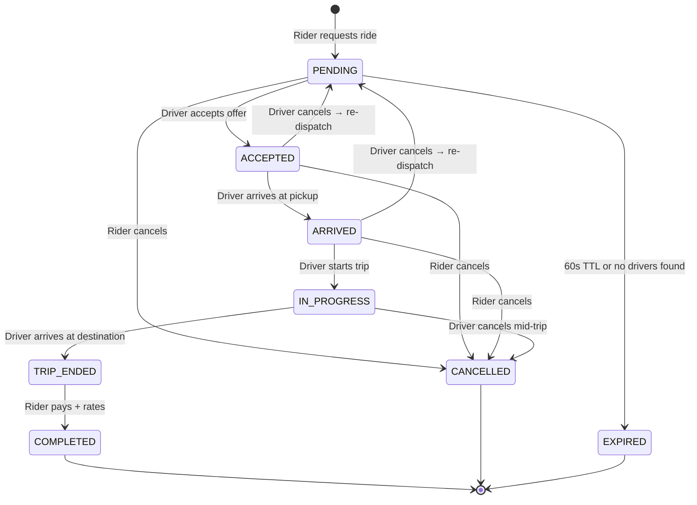
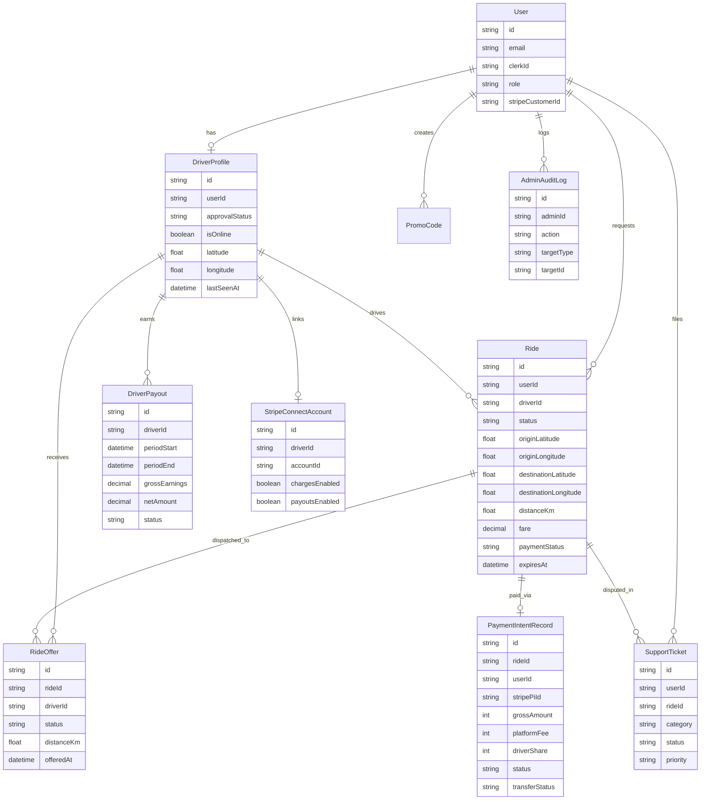
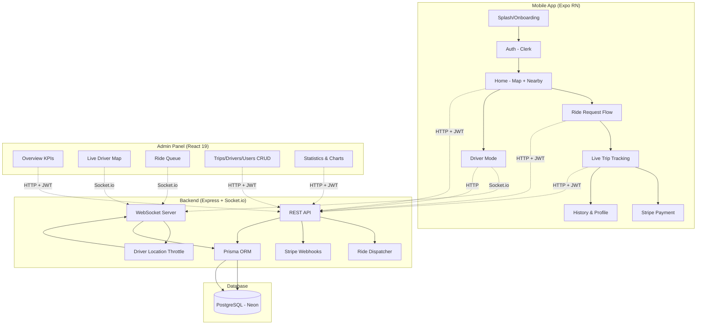

<div align="center">

# Drivo

**Full-stack ride-hailing MVP — React Native + Express + PostgreSQL**

<p align="center">

               

</p>

Real-time ride matching, live GPS tracking, driver dispatch with offer/accept/timeout — an Uber-inspired ride-hailing MVP in a single repository.

[Getting Started](#getting-started) · [Architecture](#architecture) · [API Reference](#api-reference) · [WebSocket Events](#websocket-events) · [Screenshots](#screenshots)

</div>

---

## Overview

Drivo is a ride-hailing MVP combining a driver mode (sign up → get approved → go online → stream location) with a rider flow (pick destination → see nearby cars → request ride → get matched). An admin dashboard provides a real-time overview — KPIs, alerts, and a ride queue — plus full CRUD for trips, drivers, users, payments, promos, support tickets, and audit logs. Supports English and Arabic (RTL).

**Mobile App (Expo React Native) — riders + drivers**

```
┌──────────────┐   HTTP + JWT   ┌──────────────┐   Prisma   ┌────────────┐
│  Mobile App  │ ────────────→  │              │ ─────────→ │ PostgreSQL │
│  (Expo RN)   │ ←────────────  │  Express API │ ←───────── │  (Neon)    │
│  rider +     │                │  (Backend)   │            └────────────┘
│  driver mode │                │              │
└──────┬───────┘                └──────┬───────┘
       │ socket.io                     │
       │ (ride offers, status,        │
       │  nearby drivers, ETA)         │
       └──────────────────────────────┘
```

**Admin Panel (React 19) — separate client, same backend**

```
┌──────────────┐   HTTP + JWT   ┌──────────────┐   Prisma   ┌────────────┐
│  Admin Panel │ ────────────→  │  Express API │ ─────────→ │ PostgreSQL │
│  (React 19)  │ ←────────────  │  (Backend)   │ ←───────── │  (Neon)    │
│  Vite SPA    │                │              │            └────────────┘
└──────┬───────┘                └──────┬───────┘
       │ socket.io                     │
       │ (drivers:locations snapshot,  │
       │  admin:overview:update,       │
       │  admin:ride:updated,          │
       │  admin:alert)                 │
       └──────────────────────────────┘
```

Both clients talk to the same Express API. Drivers stream location via socket.io → server throttles broadcasts → admin receives the 1s snapshot for the live map, KPIs, and alerts.

---

## Tech Stack

### Mobile App

| Category | Technology | Purpose |
|----------|-----------|---------|
| Framework | React Native + Expo SDK 56 | Cross-platform mobile build |
| Routing | Expo Router (file-based) | File-system navigation |
| Styling | NativeWind v5 (Tailwind CSS) | Utility-first CSS |
| State | React Hook Form + Zod v4 | Form handling + validation |
| Auth | Clerk Expo | Social + email auth |
| Maps | react-native-maps | Native Google Maps |
| Payments | Stripe React Native | PaymentSheet UI |
| Real-time | Socket.io Client | Live ride updates |
| Location | expo-location + expo-task-manager | Background GPS streaming |
| i18n | i18next + react-i18next | English + Arabic (RTL) |

### Backend

| Category | Technology | Purpose |
|----------|-----------|---------|
| Runtime | Node.js + Express 4 | HTTP API server |
| Language | TypeScript 5.8 (ESM) | Type-safe modules |
| ORM | Prisma 6.6 | Schema-first database access |
| Database | PostgreSQL (Neon) | Serverless Postgres |
| Auth | Clerk (Express + Backend SDK) | JWT verification, RBAC |
| Payments | Stripe (Connect + Webhooks) | PaymentIntents, driver payouts |
| Real-time | Socket.io 4.8 | Bidirectional events |
| Validation | Zod | Request/response schemas |
| Security | Helmet, CORS | HTTP hardening |

### Admin Dashboard

| Category | Technology | Purpose |
|----------|-----------|---------|
| Framework | React 19 + Vite 8 | SPA build tool |
| Routing | React Router DOM 7 | Client-side routing |
| Data | TanStack React Query 5 | Server state + caching |
| Styling | Tailwind CSS 4 | Utility-first CSS |
| Charts | Recharts 3 | Revenue, completion stats |
| Maps | Leaflet + React Leaflet | Live driver map |
| Real-time | Socket.io Client | Live updates |
| Auth | Clerk React | Admin sign-in |
| i18n | i18next + react-i18next | English + Arabic (RTL) |

### Infrastructure

| Service | Platform | Details |
|---------|----------|---------|
| Backend | Railway | Docker multi-stage build, Prisma migrations |
| Admin | Vercel | Static SPA via Vite |
| Mobile | EAS Build | Internal APK distribution |
| Database | Neon | Serverless PostgreSQL with branching |
| Auth | Clerk | Managed authentication |
| Payments | Stripe Connect | Marketplace payments + driver payouts |

---

## Screenshots

### Mobile App — All Screens

<p align="center">
  
  
  
  
  
  
  
  
  
  
  
  
  
  
  
  
  
  
  
  
  
  
  
  
  
  
  
</p>

### Admin Dashboard — All Screens

<p align="center">
  
  
  
  
  
  
  
  
</p>

---

## Features

| Area | What it does |
|------|-------------|
| **Auth & Onboarding** | Clerk authentication, 3-slide onboarding, profile management |
| **Driver Mode** | Go online, background GPS streaming, 10s heartbeat, 15s stale sweep, connectivity-aware fallback |
| **Live Driver Map** | Admin sees every online driver in real time via throttled socket broadcasts |
| **Admin Dashboard** | Overview KPIs, live alerts (long wait, stuck trip, pending approval), ride queue |
| **Ride Requests** | Pick destination (Google Places autocomplete), fare estimate (Google Routes API), haversine fallback |
| **Real-Time Matching** | Nearest-driver dispatch, 20s offer timeout, accept/reject, automatic escalation to next candidate |
| **Driver Trip Panel** | Incoming ride card with pickup/dropoff/fare/ETA, accept/reject with countdown |
| **Ride Lifecycle** | Full state machine: PENDING → ACCEPTED → ARRIVED → IN_PROGRESS → TRIP_ENDED → COMPLETED, with arrive/start/complete transitions |
| **Post-Trip Payment** | Driver taps "Arrived at Destination" → rider receives Stripe PaymentSheet → payment captured → driver can complete trip |
| **Cancellation** | Rider can cancel pending rides, driver can cancel mid-trip with reason selection (late, no show, vehicle issue, etc.) |
| **Trip Summary** | Post-trip summary dialog with fare, distance, duration, rating |
| **Ride History** | Paginated history with date grouping, filter tabs, pull-to-refresh |
| **Ride Cards** | Redesigned cards with map thumbnails, origin/destination icons, fare, distance, rating |
| **Rating System** | 5-star rating with optional feedback — available on trip card and inline in history |
| **Real-Time ETA** | Live ETA updates during trip via Google Routes API polling (20s interval) |
| **Nearby Drivers** | Rider sees nearby online cars as map markers in real time |
| **Admin Trips** | List, filter, search, detail, and cancel trips from admin dashboard |
| **Admin Drivers** | Approve, reject, suspend, reinstate drivers; view details and live locations |
| **Admin Users** | List users by role, search, view details and trip/ticket history |
| **Admin Statistics** | Revenue, completion rate, daily stats, top drivers via charts |
| **Admin Payments** | Payout list with status filter and update-to-paid |
| **Admin Support** | Ticket list with status/priority filters, detail, status updates |
| **Admin Audit** | Full audit log of admin actions |
| **i18n** | English and Arabic (RTL) support across all three projects |

---

## Ride Lifecycle

The ride state machine is the core business logic — a single source of truth for which status may follow which. Illegal transitions are impossible by design.



### State transitions

| From | To | Trigger |
|------|-----|---------|
| PENDING | ACCEPTED | Driver accepts dispatch offer |
| PENDING | CANCELLED | Rider cancels |
| PENDING | EXPIRED | 60s TTL expires, no driver accepted |
| ACCEPTED | ARRIVED | Driver arrives at pickup location |
| ACCEPTED | PENDING | Driver cancels — ride re-dispatches to next candidate |
| ACCEPTED | CANCELLED | Rider cancels |
| ARRIVED | IN_PROGRESS | Driver starts the trip |
| ARRIVED | PENDING | Driver cancels — ride re-dispatches |
| ARRIVED | CANCELLED | Rider cancels |
| IN_PROGRESS | TRIP_ENDED | Driver arrives at destination |
| IN_PROGRESS | CANCELLED | Driver cancels mid-trip |
| TRIP_ENDED | COMPLETED | Payment captured + rider rates |

### Dispatch flow

1. Rider requests ride → created as `PENDING` with `expiresAt = now + 60s`
2. Dispatcher ticks every **1s**, finds unoffered pending rides
3. For each ride: count failed offers → determine radius (3km → 6km → 12km, widens every 2 failures)
4. Query nearest eligible driver (online, approved, fresh heartbeat, no active trip)
5. Exclude drivers who responded within last **30s cooldown**
6. Create offer → emit `ride:new-request` to driver's socket
7. Driver has **20s** to respond:
   - **Accept** → ride `ACCEPTED`, all other offers expired atomically
   - **Reject** → offer `REJECTED`, next tick escalates to next candidate
   - **Timeout** → offer `EXPIRED`, next tick escalates
8. If no candidates at max radius (12km) → ride stays `PENDING` until 60s TTL

---

## Authentication

### Architecture

Clerk handles all authentication — no custom JWT implementation. The system has two roles: `USER` and `ADMIN`.

```
┌─────────────┐     ┌─────────────┐     ┌─────────────┐
│  Mobile App  │────→│ Clerk SDK   │────→│ Clerk API   │
│  (Expo RN)   │←────│ (token)     │←────│ (JWT sign)  │
└──────┬───────┘     └─────────────┘     └─────────────┘
       │
       │ HTTP + Clerk JWT
       ▼
┌─────────────┐     ┌─────────────┐
│  @clerk/    │────→│  verifyToken │
│  express    │     │  (RBAC)     │
└─────────────┘     └──────┬──────┘
                           │
                    ┌──────▼──────┐
                    │  PostgreSQL  │
                    │  (role check)│
                    └─────────────┘
```

### HTTP auth flow

1. Mobile app obtains a Clerk session token after sign-in
2. Every API request includes `Authorization: Bearer <clerk_session_token>`
3. `@clerk/express` middleware calls `getAuth(req)` to verify the JWT
4. If `auth.isAuthenticated === false` → HTTP 401
5. For admin routes: `requireAdminPermission(permission)` middleware checks:
   - User exists in DB with `role === ADMIN`
   - User has the specific permission (19 granular permissions defined)
   - Action is logged to `AdminAuditLog`

### Socket auth flow

Socket.io connections can't use Express middleware, so auth is handled separately:

1. Client connects with `socket.handshake.auth.token` (Clerk session JWT)
2. Server calls `verifyToken(token, { secretKey })` from `@clerk/backend`
3. Extracts `payload.sub` as `clerkId`, looks up user in DB
4. Sets `socket.data.user = { userId, clerkId, role }`
5. Socket joins its own `clerkId` room for targeted events

### RBAC permissions

```
dashboard.read, dashboard.manage
trips.read, trips.manage, trips.cancel
drivers.read, drivers.approve, drivers.suspend
users.read, users.block, users.manage
payments.read, payments.refund
promos.manage
support.read, support.manage
settings.manage
audit.read
```

---

## Real-Time Communication

### Architecture

```
Mobile Driver                    Server                     Admin Dashboard
     │                              │                              │
     │── driver:location ──────────→│                              │
     │                              │── broadcastNearbyDrivers()   │
     │                              │   (1s throttle, dirty flag)  │
     │←─ drivers:nearby ───────────│                              │
     │                              │                              │
     │── driver:heartbeat ─────────→│                              │
     │                              │── refreshSeenAt()            │
     │                              │                              │
     │                              │── stale sweep (5s)           │
     │                              │   mark offline if silent 15s │
     │                              │                              │
     │                              │── sendSnapshotTo(io) ───────→│
     │                              │   (1s throttle, dirty flag)  │
     │                              │   drivers:locations          │
```

### Location throttling

Drivers emit `driver:location` with `{ lat, lng, heading }`. The server uses a **dirty-flag + setTimeout coalescing** pattern:

- When a location arrives: set `nearbyDriversDirty = true`, start a 1s timer if not running
- When the timer fires: build payload from all cached positions, emit `drivers:nearby` to all sockets, reset dirty flag
- `flushNearbyDriversNow()` bypasses the throttle for immediate delivery (e.g., driver comes online)

The admin live map uses the same pattern — a separate 1s throttle emits `drivers:locations` to the `admins` room.

### Stale driver detection

Server-side liveness checking (device is not trusted):

| Constant | Value | Purpose |
|----------|-------|---------|
| `DRIVER_STALE_MS` | 15s | Silence threshold before offline |
| `STALE_CHECK_INTERVAL_MS` | 5s | Sweep frequency |
| `NEARBY_DRIVERS_BROADCAST_MS` | 1s | Broadcast coalescing window |

Every 5s, the sweep runs: any driver with `isOnline = true` and `lastSeenAt < now - 15s` gets flipped offline. If any rows changed, a fresh snapshot is broadcast to admins and riders.

### Dispatch timing

| Constant | Value | Purpose |
|----------|-------|---------|
| `OFFER_TTL_MS` | 20s | Driver response window |
| `REOFFER_COOLDOWN_MS` | 30s | Cooldown before re-offering to same driver |
| `RIDE_TTL_MS` | 60s | Total ride lifetime |
| `DISPATCH_SWEEP_INTERVAL_MS` | 1s | Dispatcher tick frequency |
| `DISPATCH_RADIUS_LADDER_KM` | [3, 6, 12] | Progressive search radius |
| `WIDEN_EVERY_OFFERS` | 2 | Failed offers before radius widens |

---

## Database Design

12 tables across 4 domains — users, rides, payments, and admin.



### Key tables

| Domain | Tables | Purpose |
|--------|--------|---------|
| **Users** | `User`, `DriverProfile` | Rider accounts + driver applications with GPS state |
| **Rides** | `Ride`, `RideOffer` | Ride lifecycle + per-driver dispatch offers |
| **Payments** | `PaymentIntentRecord`, `StripeConnectAccount` | Stripe PI tracking + driver Connect onboarding |
| **Admin** | `AdminAuditLog`, `PromoCode`, `SupportTicket`, `DriverPayout` | Audit trail, promotions, support, payouts |

### Performance indexes

```sql
-- Driver location queries (nearest driver dispatch)
CREATE INDEX idx_driver_online_lastseen ON driver_profiles (is_online, last_seen_at);
CREATE INDEX idx_driver_online_approval ON driver_profiles (is_online, approval_status);

-- Ride queries (active ride lookup, expiry sweep)
CREATE INDEX idx_ride_user_status_created ON rides (user_id, status, created_at);
CREATE INDEX idx_ride_status_expires ON rides (status, expires_at);

-- Offer queries (dispatch + re-offer cooldown)
CREATE INDEX idx_offer_driver_status ON ride_offers (driver_id, status);
CREATE INDEX idx_offer_ride_status ON ride_offers (ride_id, status);
```

---

## Architecture

### Backend

```
src/
├── server.ts                    # Entry point
├── config/                      # Env, database, ride config, realtime
├── modules/
│   ├── rides/                   # Ride CRUD, state machine, dispatch, notifications
│   │   ├── trip-state-machine.ts
│   │   ├── ride-dispatcher.ts
│   │   └── ride.service.ts
│   ├── drivers/                 # Applications, availability, location, Connect onboarding
│   ├── directions/              # Google Routes distance/duration proxy
│   ├── payments/                # Stripe payments, Connect transfers, webhooks
│   ├── users/                   # User CRUD
│   ├── places/                  # Google Places autocomplete proxy
│   └── admin/                   # Admin dashboard API
│       ├── drivers/             # Approve/reject/suspend/reinstate + live map
│       ├── trips/               # List, detail, cancel
│       ├── users/               # List, detail, roles
│       ├── overview/            # KPIs, alerts, ride queue
│       ├── stats/               # Charts, revenue, top drivers
│       ├── payments/            # Payout list, status updates
│       ├── support/             # Ticket list, detail, status
│       └── audit/               # Audit log
├── sockets/                     # Socket.io setup, auth, stale detection, admin emit
└── shared/                      # RBAC, errors, middleware, helpers
```

### Mobile

```
src/
├── app/                         # Expo Router (file-based)
├── features/
│   ├── auth/                    # Sign in, sign up, onboarding
│   ├── home/                    # Map, nearby cars, recent rides
│   ├── rides/                   # Ride request, trip, bottom sheet, markers, Stripe payments
│   ├── drivers/                 # Driver mode, trip panel, incoming rides
│   ├── history/                 # Ride history with filters
│   └── profile/                 # Profile + driver section
├── api/                         # Axios client + interceptors
├── shared/                      # Reusable components, navigation, utils
└── lib/                         # Context providers
```

### Admin

```
src/
├── components/
│   ├── Layout/                  # AdminLayout, AdminHeader, AdminSidebar
│   ├── LanguageSwitcher.tsx     # English/Arabic toggle via React Portal
│   ├── ThemeToggle.tsx          # Light/dark mode toggle
│   └── SignedOutScreen.tsx
├── contexts/                    # LocaleContext, ThemeContext, useLocale, useTheme
├── features/
│   ├── overview/                # KPIs, alerts, ride queue
│   ├── trips/                   # List, filter, search, detail, cancel
│   ├── drivers/                 # Dashboard, approve/reject/suspend, detail
│   ├── users/                   # List, search, detail, roles
│   ├── statistics/              # Charts, revenue, top drivers
│   ├── payments/                # Payout list, status updates
│   ├── support/                 # Ticket list, detail, status updates
│   ├── settings/                # Settings screen
│   └── audit/                   # Audit log
├── i18n/                        # i18next, English/Arabic locales, direction utils
├── lib/                         # Socket client, queryClient
└── types/admin.ts               # Shared TypeScript types
```

---

## Engineering Decisions

### Why Express over NestJS?

Express was chosen for speed of iteration. NestJS adds decorators, modules, and dependency injection that pay off at scale — but for an MVP with a small team, Express + TypeScript gives the same type safety with less ceremony. The module structure (`modules/rides/`, `modules/drivers/`) provides organization without framework overhead.

### Why Prisma over Drizzle?

Prisma's schema-first approach made the data model the source of truth. The generated client catches relation errors at compile time, and `prisma migrate` handles schema evolution. Drizzle is lighter and closer to SQL, but Prisma's DX (autocomplete, relation queries, transaction API) was more productive for a solo developer.

### Why Socket.io over native WebSocket?

Socket.io provides automatic reconnection, room-based routing, and fallback to long-polling. The driver location system relies on rooms (`admins`, per-clerkId rooms) and broadcast patterns that would require significant boilerplate with raw WebSocket. The overhead is negligible for this scale.

### Why Clerk over Firebase Auth or Supabase Auth?

Clerk provides managed user management with built-in social providers (Google), multi-factor support, and session handling. The Expo SDK integrates cleanly with token caching. Firebase Auth would lock us into Google's ecosystem; Supabase Auth requires running a separate service. Clerk's webhook for user sync kept the backend in sync without custom JWT verification.

### Why Neon over Supabase or self-hosted Postgres?

Neon's serverless Postgres scales to zero when idle (free tier), provides branching for preview environments, and requires no infrastructure management. Supabase adds a real-time layer we don't need (we use Socket.io), and self-hosted Postgres would require maintaining a VM.

### Why multi-stage Docker build?

The production image only contains the compiled JS and node_modules — no TypeScript, no devDependencies, no source code. This reduces the image from ~800MB to ~200MB and eliminates dev-only attack surface. The build stage runs `prisma generate` and `tsc`, the production stage runs `node dist/server.js`.

### Why progressive dispatch radius?

Starting at 3km and widening to 6km then 12km every 2 failed offers mimics Uber's dispatch strategy. It exhausts nearby drivers before reaching further ones, reducing average pickup time. The 30s re-offer cooldown prevents spam while giving rejected drivers a second chance.

---

## API Reference

Base URL: `https://drivo-production-22df.up.railway.app/api`

### Rides

| Method | Path | Auth | Description |
|--------|------|------|-------------|
| POST | `/rides` | Rider | Request a ride |
| GET | `/rides/me/active` | Either | Current active ride |
| DELETE | `/rides/:id/cancel` | Either | Cancel a ride |
| POST | `/rides/:id/arrive` | Driver | Mark arrived at pickup |
| POST | `/rides/:id/start` | Driver | Start the trip |
| POST | `/rides/:id/arrived-at-destination` | Driver | Signal arrival at destination (triggers payment) |
| POST | `/rides/:id/complete` | Driver | Complete the trip (requires payment) |
| POST | `/rides/:id/no-show` | Driver | Report rider no-show |
| POST | `/rides/:id/accept` | Driver | Accept dispatched offer |
| POST | `/rides/:id/reject` | Driver | Decline offer |
| GET | `/rides/history` | Rider | Paginated ride history |

### Drivers

| Method | Path | Auth | Description |
|--------|------|------|-------------|
| POST | `/drivers/apply` | Clerk | Apply to become a driver |
| GET | `/drivers/my-application` | Clerk | Application + profile status |
| PUT | `/drivers/availability` | Clerk | Go online/offline |
| POST | `/drivers/location` | Clerk | REST fallback for live location |
| GET | `/drivers/nearby` | Clerk | Online drivers around a point |

### Directions & Places

| Method | Path | Auth | Description |
|--------|------|------|-------------|
| GET | `/directions` | Clerk | Route distance/duration |
| GET | `/directions/eta` | Clerk | Live ETA proxy |
| GET | `/places/autocomplete` | Clerk | Google Places autocomplete |

### Admin

| Method | Path | Auth | Description |
|--------|------|------|-------------|
| GET | `/admin/overview` | Admin | KPIs, counts, alerts, ride queue |
| GET | `/admin/trips` | Admin | List trips with filters, search, pagination |
| GET | `/admin/trips/:id` | Admin | Trip detail with rider/driver/offers |
| PUT | `/admin/trips/:id/cancel` | Admin | Cancel a trip with reason |
| GET | `/admin/drivers` | Admin | All driver applications with filtering |
| GET | `/admin/drivers/live` | Admin | Online drivers with live coordinates |
| GET | `/admin/drivers/:id` | Admin | Driver detail |
| GET | `/admin/drivers/:id/detail` | Admin | Full driver detail with stats and trips |
| PUT | `/admin/drivers/:id/approve` | Admin | Approve application |
| PUT | `/admin/drivers/:id/reject` | Admin | Reject application |
| PUT | `/admin/drivers/:id/suspend` | Admin | Suspend driver |
| PUT | `/admin/drivers/:id/reinstate` | Admin | Reinstate driver |
| GET | `/admin/users` | Admin | List users by role with search and pagination |
| GET | `/admin/users/:id` | Admin | User detail with trips and tickets |
| GET | `/admin/stats` | Admin | Revenue, completion rate, daily stats, top drivers |
| GET | `/admin/payments` | Admin | Payout list with status filter and pagination |
| PUT | `/admin/payments/:id/status` | Admin | Update payout status |
| POST | `/payments/pay-for-ride` | Rider | Create PaymentIntent and confirm via PaymentSheet |
| GET | `/payments/payment-status/:rideId` | Rider | Get payment status for a ride |
| POST | `/webhooks/stripe` | Stripe | Stripe webhook handler (payment_intent.succeeded, payment_intent.payment_failed, account.updated) |
| GET | `/admin/support` | Admin | Ticket list with status/priority filter |
| GET | `/admin/support/:id` | Admin | Ticket detail |
| PUT | `/admin/support/:id/status` | Admin | Update ticket status |
| GET | `/admin/audit` | Admin | Audit log with filters and pagination |

## WebSocket Events

| Event | Direction | Description |
|-------|-----------|-------------|
| `driver:online` | driver → server | Driver declares online (gated on APPROVED) |
| `driver:offline` | driver → server | Driver declares offline |
| `driver:location` | driver → server | Live position ping |
| `driver:heartbeat` | driver → server | Liveness ping (no location change) |
| `driver:status` | server → driver | ACK the online transition |
| `admin:join` | admin → server | Subscribe to driver locations |
| `drivers:locations` | server → admin | Full snapshot (1s throttle) |
| `drivers:nearby` | server → rider | Online cars around rider |
| `ride:new-request` | server → driver | Dispatched ride offer (20s window) |
| `ride:accepted` | server → rider | Driver accepted the ride |
| `ride:assigned` | server → rider | Driver info payload |
| `ride:updated` | bidirectional | Status changes (arrived, started, completed, payment confirmed) |
| `ride:expired` | server → rider | TTL expiry signal |
| `admin:ride:updated` | server → admin | Ride state change notification |
| `admin:driver:status` | server → admin | Driver online/offline/approval status |
| `admin:overview:update` | server → admin | Overview data refresh push |
| `admin:alert` | server → admin | Alert notification (long wait, stuck trip, pending approval) |

---

## Getting Started

### Backend

```bash
cd backend
npm install
cp .env.example .env       # fill DATABASE_URL, Clerk keys, Stripe keys
npx prisma migrate dev
npm run dev                # → http://localhost:3000
```

### Mobile

```bash
cd mobile
npm install
cp .env.example .env       # fill EXPO_PUBLIC_STRIPE_PUBLISHABLE_KEY
npx expo run:android       # dev build — required for background location
```

> Background location + live driver task require native modules. Rebuild after `npm install`.

### Admin

```bash
cd admin
npm install
cp .env.example .env.local
npm run dev                # → http://localhost:5173
```

## Development Workflow

| Project | Command | Port |
|---------|---------|------|
| Backend | `cd backend && npm run dev` | `3000` |
| Mobile | `cd mobile && npx expo run:android` | `8081` |
| Admin | `cd admin && npm run dev` | `5173` |

## Deployment

| Service | Platform | Details |
|---------|----------|---------|
| Backend | Railway | Docker container (multi-stage build), Prisma migrations, Neon Postgres |
| Admin Dashboard | Vercel | Static SPA build via Vite |
| Mobile App | EAS Build | Internal APK distribution |

## Architecture Diagram



---

## License

MIT
